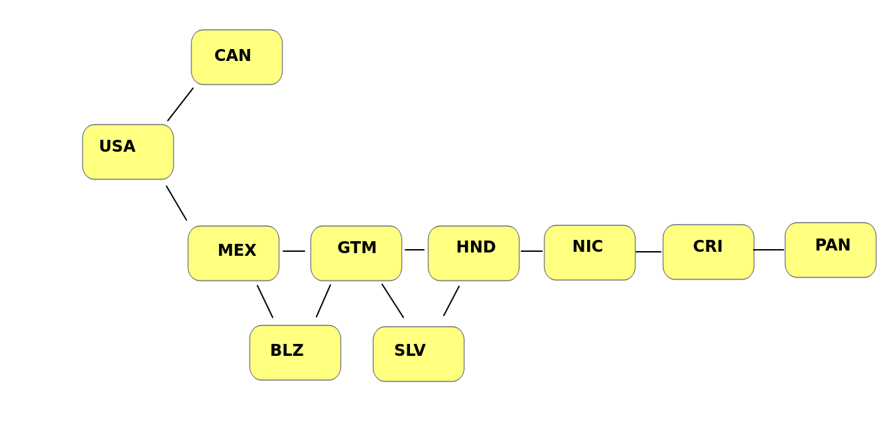

# Fast Trucks
> Project prepared as a recruitment task

## Versions
1. On branch 'main', [web page](https://fast-trucks-map-3xxri.ondigitalocean.app/api), is Web Api without UI.
This version was completed within the stipulated deadline (two working days before the interview) and complies with the instructions.

2. On branch 'frontend', [web page](https://fast-trucks-front-gw9ky.ondigitalocean.app/), is React/flask app with UI.
This version has been expanded after the deadline and modifies the instructions provided.

## Preliminary assumptions
1. There is a map of countries bordering each other
2. Each country shares a border with at least one other country
3. Distances between countries are irrelevant or not indicated
4. Countries are marked with a three-letter abbreviation in capital letters
5. Travel always start in USA

## Task
Create Web Api with endpoint where country code can be send and in return sender will receive list of countries his truck will travel through.

## Further assumptions and conclusions
1. Countries may border one or more others. This means that the correct structure will be a graph
2. The distances between countries are not given. But in reality, that would be one of the more important factors. I will try to include in the design the possibility of expansion with this factor
3. The number of countries and connections between them is small, but in reality there would be many more countries and roads connecting them. In addition, the company is large, has a lot of trucks - there can be many inquiries for different routes. Therefore, I will use a SQL database to save my data
4. Web Apis are vulnerable to external data and harmful user behavior. I have to limit the possibility of causing harm. This means that external data must be validated.

## Graph
Road map visualization:

## Technologies
Due to the small size of the project I decided to use:
* Database - MySql (managed database on digitalocean)
* Backend - Python with Flask
* React (second version, frontend branch)

## Deployment
Project and its database is hosted on digitalocean
[Link to project](https://fast-trucks-map-3xxri.ondigitalocean.app/api)

## How to use
Send http request (method GET) on link above with added parameter - one of the country codes. Country codes are available on graph screenshot. Example:
https://fast-trucks-map-3xxri.ondigitalocean.app/api/PAN
